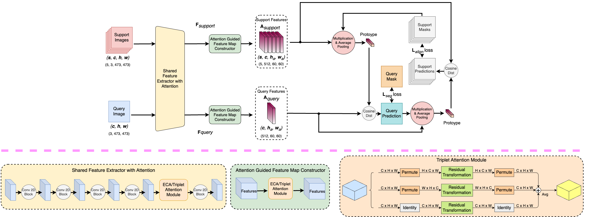

# UnderWater Few\-shot
This code is for the paper "Few-shot segmentation and Semantic Segmentation for Underwater
Imagery" (accepted to IROS2023) [[arxiv]()]

Our proposed network architecture for few-shot segmentation
<p align="left">
  
</p>

---

## Overview
This code contains our proposed network along with other baselines for comparison.

The experiments are divided into 4 independent groups for cross validation.

---

## Dependencies
python == 3.8,
pytorch == 1.6,

torchvision,
pillow,
opencv-python,
pandas,
matplotlib,
scikit-image

---

## Usage
Training and testing on our proposed network and other baseline networks can be run very easily using this code.  

### Preparation
First, download the code and install dependencies. Then download the dataset and put it in the dataset directory.

You can download dataset from [here](https://drive.google.com/file/d/14Qi3Zgb5ZL0oIsuZHDw5JmQxjOVGPtU4/view?usp=drive_link)

Also download the dataset split files from [here](https://drive.google.com/drive/folders/1IOLhsgBd2ZnVr4I10s8m4PqfP2yzpEbp?usp=drive_link) and put them in dataset_split directory


### Prepare Config Files
Four sample config files are provided in the "experiments" directory. You can modify them according to your requirements.
Please change `LOG_DIR`, `OUTPUT_DIR`, `BASE_DIR`, and dataset `ROOT` according to your folder hierarchy, Here,

- `LOG_DIR` in which file you want to save the logs;
- `OUTPUT_DIR` in which directory you want to save trained models and checkpoint;
- `BASE_DIR` this the absolute path of this repository;
- `ROOT` this is placed under `DATASET` variable in the config file. put the absolute path of dataset directory here;

#### Some Other Configuration switches

- `TRAIN` contains all the switches for initializing model and optimizer;
  - `ARCH` specify which network you want to use (options: 'asgnet', 'FPMMs', 'PAnet', 'PFENet');
  - `N_SHOTS` specify number of shots;
  - `TEST_LABEL_SPLIT_VALUE` specify on which split of dataset you want to run the validation (options: 0,1,2,3);
  - `LAYERS` determines which type of resnet backbone will be used in some networks (50 means resnet50);
  - `RESNET_PRETRAINED_MODEL` specify the path of trained resnet backbone;
  - `VGG_MODEL_PATH` specify the path of trained vgg backbone;
  - `PRETRAINED_MODEL` specify the path of pretrained model path;
- `MODEL` contain model settings;
  - `NAME` specify which network you want to use (options: 'asgnet', 'FPMMs', 'PAnet', 'PFENet');

---

## Cross-validation classes for UnderWater Few-shot
| Dataset Split     | Test class                                                |
|-------------------|-----------------------------------------------------------|
| Split<sup>0</sup> | Crab, Dolphin, Frog, Turtle, Whale                        |
| Split<sup>1</sup> | Nettles, Octopus, Sea Anemone, Shrimp, Stingray           |
| Split<sup>2</sup> | Penguin, Sea Urchin, Seal, Shark, Nudibranch              |
| Split<sup>3</sup> | Crocodile, Otter, Polar Bear, Sea Horse, Star Fish, Squid |


## Network Options

### Training
```
cd tools
python3 train.py --config path_to_config_file
```
#### Example 
```
cd tools
python3 train.py --config ../experiments/eca_net_sup_que_vgg16_config/1_shot/uw_few_shot_training_config_eca_net_sup_que_vgg16_shot_1_split_0.yaml
```

#### 1. Train  UWSNet models:

| Network   | Option to be used          |
|-----------|----------------------------|
| PANet     | basic                      |
| UWSNet v1 | eca_net_sup_que            |
| UWSNet v2 | eca_net_sup_que_vgg16      |
| UWSNet v3 | triplet_sup_que            |
| UWSNet v4 | triplet_sup_que_dice       |
| UWSNet v5 | triplet_sup_que_vgg16      |
| UWSNet v6 | triplet_sup_que_vgg16_dice |


Change the `PA_NET_TYPE` value in config file accordingly.

Training can also be run using colab notebook. [](https://colab.research.google.com/github/Imran2205/uwsnet/blob/main/colab_notebooks/few_shot_training.ipynb)

### Inference
If you want to test for a specific saved models, you can use:
```
cd tools
python3 test.py --config path_to_config_file
```
#### Example (UWSNet V2)
```
cd tools
python3 test.py --config ../experiments_inference/eca_net_sup_que_vgg16_config/1_shot/uw_few_shot_training_config_eca_net_sup_que_vgg16_shot_1_split_0.yaml
```
Set `PRETRAINED_MODEL` with the path of trained UWSNet V2. Pretrained model can be downloaded from [here](https://drive.google.com/drive/folders/1WEtRqBZgHtteCIzFHhnutp_KsXGA2Dhh?usp=drive_link).
#### Example (UWSNet V6)
```
cd tools
python3 test.py --config ../experiments_inference/triplet_sup_que_vgg16_dice_config/1_shot/uw_few_shot_training_config_triplet_sup_que_vgg16_dice_shot_1_split_0.yaml
```
Set `PRETRAINED_MODEL` with the path of trained UWSNet V6. Pretrained model can be downloaded from [here](https://drive.google.com/drive/folders/1WEtRqBZgHtteCIzFHhnutp_KsXGA2Dhh?usp=drive_link).

Must set the base architecture (`NAME` under `MODEL`) and type (`PA_NET_TYPE` under `TRAIN`) in config file according to your choice.

To run the inference in colab [](https://colab.research.google.com/github/Imran2205/uwsnet/blob/main/colab_notebooks/fewshot_inference.ipynb)
  
### Pre-trained models
- Pre-trained backbones and models can be found in [Google Driver](https://drive.google.com/drive/folders/1WEtRqBZgHtteCIzFHhnutp_KsXGA2Dhh?usp=drive_link)
- Download backbones and set the backbone model path. Pretrained backbone can be found [here](https://drive.google.com/drive/folders/15AD86KAKEpySFu8NFNZcPWE_9vmAuGx5?usp=drive_link)

## Semantic Segmentation
Under water semantic segmentation dataset is available [here](https://drive.google.com/file/d/1OUw-wFBKCHZiOuVehkOREVP6MTzxKBz9/view?usp=drive_link)
### Class Map
| Sl | Class       | Train Id | Color(r, g, b)  |
|----|-------------|----------|-----------------|
| 1  | unlabeled   | 255      | (0,   0,   0)   |
| 2  | crab        | 0        | (128, 64,  128) |
| 3  | crocodile   | 1        | (244, 35,  232) |
| 4  | dolphin     | 2        | (70,  70,  70)  |
| 5  | frog        | 3        | (102, 102, 156) |
| 6  | nettles     | 4        | (190, 153, 153) |
| 7  | octopus     | 5        | (153, 153, 153) |
| 8  | otter       | 6        | (250, 170, 30)  |
| 9  | penguin     | 7        | (220, 220, 0)   |
| 10 | polar_bear  | 8        | (107, 142, 35)  |
| 11 | sea_anemone | 9        | (152, 251, 152) |
| 12 | sea_urchin  | 10       | (70,  130, 180) |
| 13 | seahorse    | 11       | (220, 20,  60)  |
| 14 | seal        | 12       | (253, 0,   0)   |
| 15 | shark       | 13       | (0,   0,   142) |
| 16 | shrimp      | 14       | (0,   0,   70)  |
| 17 | star_fish   | 15       | (0,   60,  100) |
| 18 | stingray    | 16       | (0,   80,  100) |
| 19 | squid       | 17       | (0,   0,   230) |
| 20 | turtle      | 18       | (119, 11,  32)  |
| 21 | whale       | 19       | (111, 74,  0)   |
| 22 | nudibranch  | 20       | (81,  0,   81)  |
| 23 | coral       | 21       | (250, 170, 160) |
| 24 | rock        | 22       | (230, 150, 140) |
| 25 | water       | 23       | (180, 165, 180) |
| 26 | sand        | 24       | (150, 100, 100) |
| 27 | plant       | 25       | (150, 120, 90)  |
| 28 | human       | 26       | (153, 153, 153) |
| 29 | reef        | 27       | (0,   0,   110) |
| 30 | others      | 28       | (47,  220, 70)  |

### Train

#### HRNet V2
First install the following packages
```shell
pip install imagecodecs 
pip install pickle5
pip install timm
pip install tensorboardX
pip install yacs
```
To train HRNet V2 model on our proposed dataset run the following commands.
```shell
cd tools
python3 python3 train_hrnet_v2_final.py --cfg ../experiments/hrnet/uws_training_hrnet_v2.yaml
```

Change `ROOT` (under `DATASET`), `LOG_DIR`, `OUTPUT_DIR`, `PRETRAINED` (under `MODEL`) in the config file according to your file structure. Download the imagenet pretrained file from [here](https://drive.google.com/file/d/1B4Xh2rhIGe8oMQtOd2znNsc3oIb32lu8/view?usp=drive_link)

To run the training in colab [](https://colab.research.google.com/github/Imran2205/uwsnet/blob/main/colab_notebooks/uw_sem_seg_hrnet_v2_train.ipynb)


#### Mask2Former
To train Mask2Former model the following packages needs to be installed
```shell
pip install cython
pip install scipy
pip install shapely
pip install timm
pip install h5py
pip install submitit
pip install scikit-image
python3 -m pip install 'git+https://github.com/facebookresearch/detectron2.git'
```

Clone the modified mask2former repository using,

```shell
git clone https://github.com/Imran2205/Mask2Former-mod
```
Then run the following command
```shell
cd /kaggle/working/Mask2Former-mod/mask2former/modeling/pixel_decoder/ops && sh make.sh
```
In the Mask2Former-mod/mask2former/data/datasets/register_uws.py file change line no 78 and 56 with the path to the semantic segmentation dataset. 
Now for training run,
```shell
cd Mask2Former-mod
python train_net.py --num-gpus 1 --config-file ../configs/uws/semantic-segmentation/maskformer2_R50_bs16_300k.yaml
```
Pretrained models are available [here](https://drive.google.com/drive/folders/1OQ8IHdf1wYZGoCVoDl_Y0i3rqPQvRnuu?usp=drive_link).

To run the training in colab [](https://colab.research.google.com/github/Imran2205/uwsnet/blob/main/colab_notebooks/uw_sem_seg_mask2former_train.ipynb)

---

## Citation
Please consider citing the paper if you find it useful:
```
@inproceedings{,
  title={},
  author={},
  booktitle={},
  year={}
}
```

---

## References
The code is based on 

* [FPMMS](https://github.com/Yang-Bob/PMMs)
* [PANet architecture](https://github.com/kaixin96/PANet)
* [ECANet Attention](https://blog.paperspace.com/attention-mechanisms-in-computer-vision-ecanet/)
* [Triplet Attention](https://blog.paperspace.com/triplet-attention-wacv-2021/)
* [Dice Loss](https://github.com/pytorch/pytorch/issues/1249)

Thanks for their great work!

